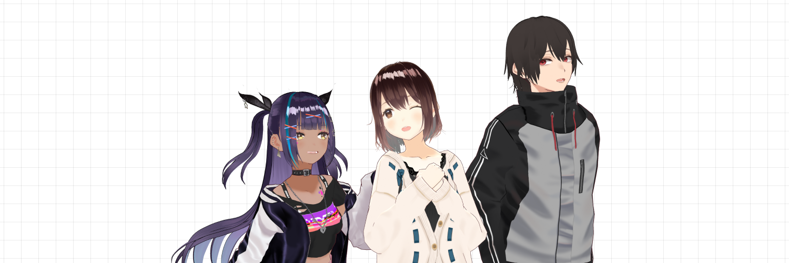
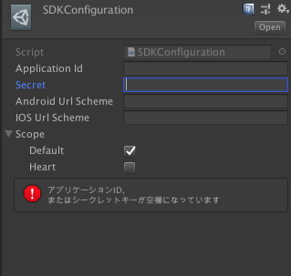

# VRoid SDK Developers


[](https://github.com/pixiv/vroid-sdk-developers/discussions)
[](./README.md)

SDKを利用して制作したアプリケーションについて、VRoid Hubへの掲載をご希望の方は、以下のフォームより申請をお願いいたします。  
[VRoid SDK アプリケーション掲載依頼](https://www.pixiv.net/support.php?type=47&mode=inquiry&service=vroid-integrate)

VRoid SDKに直接関係のないお問い合わせ（Unity側のアプリ開発のお話や、VRoidプロダクトに関するお話）についてはサポートができませんので予めご了承ください。

## VRoid SDKで何ができるのか
### OAuthを利用したVRoid Hubとの認証
VRoid SDKはVRoid Hubのモデルやユーザーの情報を利用するために、VRoid HubのAPIを経由して実現する。
VRoid HubはOAuthプロバイダで、所定の手続きを踏むことでAPIへのアクセストークンを取得できる

このアクセストークンには以下の情報が設定されている

- 利用できるAPIの制限(スコープ)
- トークンの期限

トークンの利用期限が切れた場合、VRoid SDKは自動的にトークンの再発行を行う
APIの利用には、OAuthでの連携が必要だが、その実装はかなり煩雑なため、SDKで簡単に実行できるインターフェースが提供されている

### VRoid HubのAPI実行
SDK経由でVRoid HubのAPIをC#から実行が可能
実行結果は、C#から利用するために構造体としてシリアライズされる
使用可能なAPIは発行されたトークンのスコープによって決められているため利用するアプリケーションによって適宜チェックを行うこと

- `default`
	- ユーザ情報の取得
	- モデル情報の取得、ダウンロード
- `heart`
	- モデルへハートをつける
  - モデルのハートを取り消す

### VRoid HubのモデルをUnityで使えるように変換
- VRoid HubのCharacterModel IDを利用し、VRoid HubからのモデルダウンロードからUnityで使えるGameObjectへの変換、ローカルへのキャッシュ保存までひとつのメソッドで行える
- 一度ダウンロードしたモデルは、暗号化してキャッシュとして保存され、キャッシュが存在する限りはダウンロードが不要になる

## 使い方
- ダウンロードしてきたVRoid SDKのunitypackageをUnityにインポート
- [連携アプリケーション管理画面](https://hub.vroid.com/oauth/applications)から「新しいアプリケーション」を作成
- SDKConfiguration (Assets/VRoidSDK/Plugins/SDKConfigurations/SDKConfiguration.assets) を作成したアプリケーションの情報をもとに設定
- スクリプティング

### 連携アプリケーションの作成

#### アプリケーション名
- 作成するアプリケーション名

#### リダイレクトURI
- 認可コードの受け取りにつかうURI
  - iOS/Androidの場合は利用するアプリで使われるURLスキーム
  - PC向けOSの場合は、`urn:ietf:wg:oauth:2.0:oob`
- 複数のプラットフォームをサポートする場合は改行で追加していく

#### スコープ
- 利用できるAPIを決めるスコープ
	- default
		- ユーザ情報の取得やモデルのダウンロードなど基本的なAPI機能のみ
	- heart
		- ハートの追加や削除などのAPI
#### サービス
- URLは連携確認画面で表示されるURL, 概要は同じく連携画面で表示される概要
#### モデルの使用情報
- モデルを改変する
	- 「はい」にした場合、モデルの改変設定をNGにしている他人のモデルを取得できなくする
- モデルを再配布する
	- 「はい」にした場合、モデルの再配布を許可しない他人のモデルを取得できなくする
- アバターとして利用する
	- 「はい」にした場合、アバターとして他者が演じるのを許可しない他人のモデルを取得できなくする
- モデルを利用して性的表現をする
  - 「はい」にした場合、性的表現目的での利用を許可しない他人のモデルを取得できなくする
- モデルを利用して暴力表現をする
  - 「はい」にした場合、暴力表現目的での利用を許可しない他人のモデルを取得できなくする
- モデルのクレジット表示が可能
  - 「いいえ」にした場合、クレジット表示を必要にした他人のモデルを取得できなくする
- アプリの種別
	- 個人向けサービスか法人向けサービスか
  - 法人向けの場合は、法人の商用利用可能のモデルのみが取得できる
- 商用利用
  - アプリ種別を個人向けサービスに指定した場合、商用利用をどこまで許可するかを選択できる
  - 商用利用がこの設定の範囲外のモデルは取得することができない

#### 閲覧制限モデルの利用
- 閲覧制限のあるモデルをアプリケーションで利用したくない場合に設定する

### SDKConfiguration


#### Application ID
- OAuthプロバイダに設定して作成された「アプリケーションID」
#### Secret
- OAuthプロバイダに設定して作成された「シークレット」
#### Android Url Scheme
- Android向けに登録したリダイレクトURI
#### iOS Url Scheme
- iOS向けに登録したリダイレクトURI
#### Scope
- アプリで利用するAPIスコープ

### スクリプティング
#### VRoid SDKの初期化

```csharp
public class LoginCanvas : MonoBehaviour
{
    // SDKConfigurationをUnity上で設定できるようにする
    [SerializeField] private SDKConfiguration sdkConfiguration;

    private void Awake()
    {
        // SDKConfigurationからメタデータを取り出し、初期化
        Authentication.Instance.Init(sdkConfiguration.AuthenticateMetaData);
    }
}
```

#### OAuthの認証

```csharp
Authentication.Instance.AuthorizeWithExistAccount((bool isAuthSuccess) =>
{
    if (!isAuthSuccess)
    {
        // このアプリケーションでは初めての認証である
        // ブラウザを開き、VRoid Hubサイト上にてアプリケーション連携の許可を得てから認証処理する
        var browserAuthorize = BrowserAuthorize.GenerateInstance(sdkConfiguration);
        browserAuthorize.OpenBrowser(AfterBrowserAuthorize);
    }
    else
    {
        AfterBrowserAuthorize(true);
    }
},
(System.Exception e) => {
    // ネットワークエラーやタイムアウト(120秒)などの問題が発生
});
```

iOS/Androidの場合は、URLスキーム経由でOAuthの認可コードを受け取ることができるが、デスクトップアプリケーションの場合はURLスキームの呼び出しが行えないため、手動での登録が必要
ブラウザ上に表示される認可コードを `BrowserAuthorize#RegisterCode` を呼び出し、トークンの発行を行う

```csharp
/*
* 中略
*/

browserAuthorize.RegisterCode(authorizeCode);
```

#### API実行
- 一度、OAuthの認証を通すことで、VRoid HubのAPIを実行することができる
- VRoid SDKでは、Unity上から利用できるように、APIへのリクエストをラップしたメソッドを用意している
- 使えるAPIは、[HubApi](https://developer.vroid.com/sdk/docs/VRoidSDK.HubApi.html)で定義されている

例) ログインしているユーザのモデル一覧を取得

```csharp
HubApi.GetAccountCharacterModels(
    count: 10, // 最初から10件分を取得
    onSuccess: (List<CharacterModel> characterModels) => {
        /* 正常にキャラクターの情報が取得できた時の処理 */
    },
    onError: (ApiErrorFormat errorFormat) => {
        /* 通信エラーなどのエラーが発生した時の処理 */
    }
);
```

#### VRoid Hubのキャラクターモデルを変換
- VRoid Hubから得られるデータはVRMファイルになるので、それをUnity側で使えるようにGameObjectに変換する
- 内部的にはUniVRMを使って変換を行い、それをアプリケーションのコールバックに渡している
- ダウンロードしたファイルは暗号化してキャッシュに保存する

```csharp
HubModelDeserializer.Instance.LoadCharacterAsync(
    characterModelId: characterModelId, // CharacterModel#id を渡す
    onDownloadProgress: (float progress) =>
    {
         // VRMファイルがキャッシュされてなくダウンロードが必要な場合に、進捗状況が0.0〜1.0の間で通知される
    },
    onLoadComplete: (GameObject characterObj) =>
    {
         // UniVRMでVRMファイルから変換されたGameObjectが返される
    },
    onError: (System.Exception error) =>
    {
        // 実行中にエラーが発生した場合、呼び出される
    }
);
```

## リンク集
- [VRoid SDK 利用方法概略](https://app.box.com/s/tjhql9nm1zb3st24210d9udyg0d9h3vn)
- [公式ドキュメント](https://developer.vroid.com/sdk/docs/VRoidSDK.html)
- [VRoid SDK ガイドライン](https://vroid.pixiv.help/hc/ja/articles/900000213643-VRoid-SDK-%E3%82%AC%E3%82%A4%E3%83%89%E3%83%A9%E3%82%A4%E3%83%B3)
- [Spectrum(旧サポートフォーラム)](https://spectrum.chat/vroid-developers)
