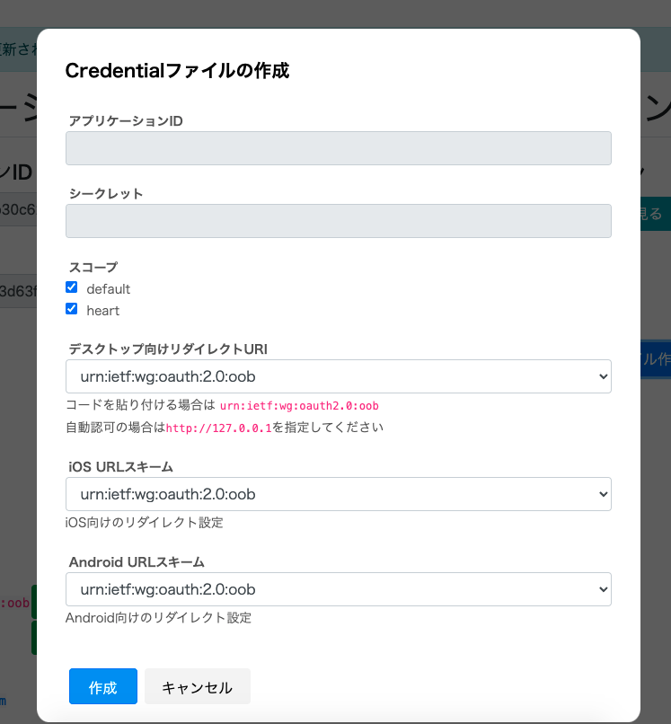

# VRoid SDK Developers


[](https://github.com/pixiv/vroid-sdk-developers/discussions)
[](./README.md)

SDKを利用して制作したアプリケーションについて、VRoid Hubへの掲載をご希望の方は、以下のフォームより申請をお願いいたします。  
[VRoid SDK アプリケーション掲載依頼](https://www.pixiv.net/support.php?type=47&mode=inquiry&service=vroid-integrate)

VRoid SDKに直接関係のないお問い合わせ（Unity側のアプリ開発のお話や、VRoidプロダクトに関するお話）についてはサポートができませんので予めご了承ください。

## VRoid SDKで何ができるのか
### OAuthを利用したVRoid Hubとの認証
VRoid SDKはVRoid Hubのモデルやユーザーの情報を利用するために、VRoid HubのAPIを経由して実現する。
VRoid HubはOAuthプロバイダで、所定の手続きを踏むことでAPIへのアクセストークンを取得できる

このアクセストークンには以下の情報が設定されている

- 利用できるAPIの制限(スコープ)
- トークンの期限

トークンの利用期限が切れた場合、VRoid SDKは自動的にトークンの再発行を行う
APIの利用には、OAuthでの連携が必要だが、その実装はかなり煩雑なため、SDKで簡単に実行できるインターフェースが提供されている

### VRoid HubのAPI実行
SDK経由でVRoid HubのAPIをC#から実行が可能
実行結果は、C#から利用するためにオブジェクトとしてシリアライズされる
使用可能なAPIは発行されたトークンのスコープによって決められているため利用するアプリケーションによって適宜チェックを行うこと

- `default`
	- ユーザ情報の取得
	- モデル情報の取得、ダウンロード
  - 写真の取得・アップロード
- `heart`
	- モデルへハートをつける
  - モデルのハートを取り消す

### VRoid HubのモデルをUnityで使えるように変換
- VRoid HubのCharacterModel IDを利用し、VRoid HubからのモデルダウンロードからUnityで使えるGameObjectへの変換、ローカルへのキャッシュ保存までひとつのメソッドで行える
- 一度ダウンロードしたモデルは、暗号化してキャッシュとして保存され、キャッシュが存在する限りはダウンロードが不要になる

## 使い方
- ダウンロードしてきたVRoid SDKのunitypackageをUnityにインポート
- [連携アプリケーション管理画面](https://hub.vroid.com/oauth/applications)から「新しいアプリケーション」を作成
- 作成したアプリケーション管理画面から、credential.json.bytesをダウンロードしプロジェクトに導入
- スクリプティング

### 連携アプリケーションの作成

#### アプリケーション名
- 作成するアプリケーション名

#### リダイレクトURI
- 認可コードの受け取りにつかうURI
  - iOS/Androidの場合は利用するアプリで使われるURLスキーム
  - Windows/MacOS向けの場合は、`urn:ietf:wg:oauth:2.0:oob` か `http://127.0.0.1`
    - アプリケーション連携時に認可コードを手動入力する場合は `urn:ietf:wg:oauth:2.0:oob`
    - アプリケーション連携時に認可コードを自動入力する場合は `http://127.0.0.1`
- 複数のプラットフォームをサポートする場合は改行で追加していく

#### スコープ
- 利用できるAPIを決めるスコープ
	- default
		- ユーザ情報の取得やモデルのダウンロードなど基本的なAPI機能のみ
	- heart
		- ハートの追加や削除などのAPI
#### サービス
- URLは連携確認画面で表示されるURL, 概要は同じく連携画面で表示される概要
#### モデルの使用情報
- モデルを改変する
	- 「はい」にした場合、モデルの改変設定をNGにしている他人のモデルを取得できなくする
- モデルを再配布する
	- 「はい」にした場合、モデルの再配布を許可しない他人のモデルを取得できなくする
- アバターとして利用する
	- 「はい」にした場合、アバターとして他者が演じるのを許可しない他人のモデルを取得できなくする
- モデルを利用して性的表現をする
  - 「はい」にした場合、性的表現目的での利用を許可しない他人のモデルを取得できなくする
- モデルを利用して暴力表現をする
  - 「はい」にした場合、暴力表現目的での利用を許可しない他人のモデルを取得できなくする
- モデルのクレジット表示が可能
  - 「いいえ」にした場合、クレジット表示を必要にした他人のモデルを取得できなくする
- アプリの種別
	- 個人向けサービスか法人向けサービスか
  - 法人向けの場合は、法人の商用利用可能のモデルのみが取得できる
- 商用利用
  - アプリ種別を個人向けサービスに指定した場合、商用利用をどこまで許可するかを選択できる
  - 商用利用がこの設定の範囲外のモデルは取得することができない

#### 閲覧制限モデルの利用
- 閲覧制限のあるモデルをアプリケーションで利用したくない場合に設定する

### 作成したアプリケーション管理画面から、credential.json.bytesをダウンロードしプロジェクトに導入
- アプリケーション管理画面から、「Credentialファイル作成」ボタンを押し、SDKの設定ファイルを作成する



### スクリプティング
#### VRoid SDKの初期化

```csharp
// ダウンロードしたcredential.json.bytesを読み込み
var credential = Resources.Load<TextAsset>("credential.json");
// 設定に使うアプリ情報
var credentialJson = credential.text;
// 認可に使うConfigの作成
var config = OauthProvider.LoadConfigFromCredential(credentialJson);
```

#### OAuthの認証

```csharp
// 通信に使うThreadContext
var context = SynchronizationContext.Current;
// OAuthの認可を扱うClientを作成する
var oauthClient = OauthProvider.CreateOauthClient(config, context);
// ログインに使うBrowserを作成
var browser = BrowserProvider.Create(oauthClient, config);
// ローカルにアカウントファイル保存済みかつ期限が切れてない
var isLoggedIn = oauthClient.IsAccountFileExist() && !oauthClient.IsAccessTokenExpired();
// ログイン
if (!isLoggedIn)
{
    // すでに認可済みだが期限切れの場合は再認可。 
    // そうでなければブラウザを開いて認可フローを開始する。
    oauthClient.Login(
      browser,
      (account) => { /*ログイン成功時*/ },
      (error) => { /*ログイン失敗時*/ }
    );
}
```

iOS/Androidの場合は、URLスキーム経由で認可コードの受け取りが可能。
デスクトップアプリケーションの場合はURLスキームの呼び出しが行えないため、手動での登録か、[Loopback interface redirect](https://datatracker.ietf.org/doc/html/rfc8252#section-8.3)で認可コードの受け取りが可能。
手動入力の場合は、ブラウザ上に表示される認可コードを `browser#OnRegisterCode` を呼び出し、トークンの発行を行う

```csharp
/*
* 中略
*/

browser.OnRegisterCode(authorizeCode);
```
#### API実行
- 認証を通した `Pixiv.VroidSdk.Oauth.Client` を使ったAPIクラスを使うことでVRoid HubのAPIを利用可能
- 使えるAPIは、[DefaultApi](https://developer.vroid.com/sdk/docs/0.1.0/Pixiv.VroidSdk.Api.DefaultApi.html), [HeartApi](https://developer.vroid.com/sdk/docs/0.1.0/Pixiv.VroidSdk.Api.HeartApi.html)


例) ログインしているユーザのモデル一覧を取得

```csharp
var oauthClient = OauthProvider.CreateOauthClient(config, context);

// 認可を行うClientを使ってDefaultApiを作成
var defaultApi = new DefaultApi(oauthClient);
// ハートスコープのAPIはHeartApiを使う
// var heartApi = new HeartApi(oauthClient);

// ログイン
if (!isLoggedIn)
{
    // すでに認可済みだが期限切れの場合は再認可。 
    // そうでなければブラウザを開いて認可フローを開始する。
    oauthClient.Login(
      browser,
      (_) => {
        // 認可完了済みならAPI機能が使える
        defaultApi.GetAccountCharacterModels(10, (characterModels) => _characterModels = characterModels, (error) => { /*取得失敗時*/ });
      },
      (error) => { /*ログイン失敗時*/ }
    );
}
```

#### VRoid Hubからモデルの読み込み
- VRoid Hubから得られるデータはVRMファイルになるので、それをUnity側で使えるようにGameObjectに変換する
- 内部的にはUniVRMを使って変換を行い、それをアプリケーションのコールバックに渡している
- ダウンロードしたファイルは暗号化してキャッシュに保存する
  - キャッシュには開発者から登録するパスワードが必要

```csharp
oauthClient.Login(
  browser,
  (account) => {
    // モデル読み込みに使うModelLoaderを初期化
    ModelLoader.Initialize(
      config,                  // Credentialから作成したConfig
      defaultApi,              // 認可済みのAPI
      "PASSWORD_FOR_YOUR_APP", // モデル暗号化のパスワード
      10                       // モデルの最大キャッシュ数
    );

    defaultApi.GetAccountCharacterModels(10, (models) => {
      // モデル読み込みの開始
      ModelLoader.LoadVrm(
        models[0],  // 読み込むモデル
        (gameObject) => {
          // 読み込み完了後のコールバック
          gameObject.transform.parent = this.transform;
        },
        (progress) => {
          // 読み込み中の進捗コールバック
        },
        (error) => {
          // エラー発生時のコールバック
        }
      );
    }, (error) => { });
  },
  (error) => { /*ログイン失敗時*/ }
);
```

## リンク集
- [導入マニュアル (v0.1.0)](https://vroid.notion.site/VRoid-SDK-0-1-0-5e8631655fcd4ed889be4f5110bc4266)
- [VRoid SDK 利用方法概略(v0.0.21)](https://app.box.com/s/tjhql9nm1zb3st24210d9udyg0d9h3vn)
- [公式ドキュメント](https://developer.vroid.com/sdk/docs/0.1.0/Pixiv.VroidSdk.html)
- [VRoid SDK ガイドライン](https://vroid.pixiv.help/hc/ja/articles/900000213643-VRoid-SDK-%E3%82%AC%E3%82%A4%E3%83%89%E3%83%A9%E3%82%A4%E3%83%B3)
- [Spectrum(旧サポートフォーラム)](https://spectrum.chat/vroid-developers)
