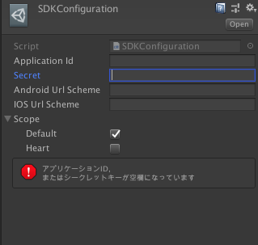

# VRoid SDK Developers

 [](https://github.com/pixiv/vroid-sdk-developers/discussions)
[](./README.ja.md)

If you are a developer and you're interented in using VRoid SDK in order to have your app featured on VRoid Hub, please apply using the application form below.  
[VRoid SDK application publication request.](https://www.pixiv.net/support.php?type=47&mode=inquiry&service=vroid-integrate)

Please note that we cannot provide support for inquiries that are not directly related to VRoid SDK (e.g inquiries about the development of apps on Unity or Inquiries about VRoid products).
## What can you do with VRoid SDK?
### Authentification of VRoid Hub using OAuth
In order to access models and users information on VRoid Hub, VRoid SDK has to go through Hub's API. VRoid Hub is an OAuth provider and you can obtain access tokens for the API by following the prescribed procedures.

The following information is set in this access token:

- API scopes limit
- Token expiration date

When a token expires, the VRoid SDK automatically reissues the token. API requires OAuth integration, which can be a complex procedure, so the SDK provides an interface where it can be easily executed.

### VRoid Hub's API Calls
You can run API calls to VRoid Hub by using C# via SDK. The call result is serialized as a struct to be used in C#. The scope of the issued token determines the availability of the API. Therefore, depending on the application, a thorough check is required.

- `default`
    - Obtaining user information
    - Obtaining and downloading model information
- `heart`
    - Hearting a model
    - Unhearting a model

### Converting VRoid Hub models so that they can be used on Unity
- By using the CharacterModel ID from VRoid Hub, you can download models and convert them to GameObject that you can use on Unity. Data is locally stored as a cache, all in one method.
- Once a model is downloaded, it is encrypted and stored as a cache. As long as it is stored within the cache, there is no need for future downloads.

## Tutorial
- Import "unitypackage" in the VRoid SDK onto Unity.
- Using the [integrated application management page](https://hub.vroid.com/oauth/applications), create a new application.
- Complete by setting SDKConfiguration (Assets/VRoidSDK/Plugins/SDKConfigurations/SDKConfiguration.assets) in the info for the new app you just created.
- Scripting.

### How to create integrated apps

#### Name of the app
- The name of the app you are creating

#### Redirect URI
- The URI used when receiving an Authorization code.
  - For iOS and Android, you should use the URI scheme for the app.
  - For computer OS, you should use `urn:ietf:wg:oauth:2.0:oob`
- If you plan your app to be multi-platform, add new lines.

#### Scope
- Scopes determining which APIs are accessible.
    - default
        - Limited to basic API features such as obtaining user information or downloading models.
    - heart
        - API for hearting and unhearting models.
#### Services
- This URL is the URL displayed on the integrated apps confirmation page, The summary is also the summary that is displayed on the same integrated apps confirmation page.
#### Model usage information
- Model alterations
    - If set to "Yes", it will prevent your app from acquiring models that do not allow alterations.
- Model redistribution
    - If set to "Yes", it will prevent your app from acquiring models that do not allow redistribution.
- Usage as avatar
    - If set to "Yes", it will prevent your app from acquiring models that do not allow usage as avatar.
- Usage in sexual depictions
  - If set to "Yes", it will prevent your app from acquiring models that do not allow sexual depictions.
- Usage in violent depictions
  - If set to "Yes", it will prevent your app from acquiring models that do not allow violent depictions.
- Crediting
  - If set to "No", it will prevent your app from acquiring models that require credit attribution.
- Application type
    - Individual or corporate use
  - If for corporate use, only models used allowing commercial use by corporations can be acquired.
- Commercial use
  - If the app is for individual use, you can set how far you want to allow commercial use.
  - If the commercial use of a model is outside the scope of the settings mentioned, it cannot be acquired.

#### Usage of age-restricted models
- Select this option if you do not want to use age-restricted models on your app.

### SDKConfiguration


#### Application ID
- The "Application ID" is created when setting up the OAuth Provider.
#### Secret
- "Secrets" that are created when setting up the OAuth Provider.
#### Android Url Scheme
- Redirect URI registered for Android.
#### iOS Url Scheme
- Redirect URI registered for iOS.
#### Scope
- Scopes determining which APIs are accessible.

### Scripting
#### Initializing the VRoid SDK

```csharp
public class LoginCanvas : MonoBehaviour
{
    // Enabling SDKConfiguration to be configured in Unity
    [SerializeField] private SDKConfiguration sdkConfiguration;

    private void Awake()
    {
        // Extracting the metadata before initializing the SDKConfiguration
        Authentication.Instance.Init(sdkConfiguration.AuthenticateMetaData);
    }
}
```

#### OAuth Authentification

```csharp
Authentication.Instance.AuthorizeWithExistAccount((bool isAuthSuccess) =>
{
    if (!isAuthSuccess)
    {
        // This is the first authentication for this application
        // Open the browser and get permission to link the application on the VRoid Hub website before authentication
        var browserAuthorize = BrowserAuthorize.GenerateInstance(sdkConfiguration);
        browserAuthorize.OpenBrowser(AfterBrowserAuthorize);
    }
    else
    {
        AfterBrowserAuthorize(true);
    }
},
(System.Exception e) => {
    // A problem, e.g. network errors or timeouts (120 seconds) has occurred
});
```

If your app is meant for iOS and/or Android, you can acquire the OAuth authentication code through the URL scheme, but if you're developing a desktop application, you are unable to call out the URL scheme, so you have to register it manually. Call for the `BrowserAuthorize#RegisterCode` that is shown on browser to issue the token.

```csharp
/*
* Omission
*/

browserAuthorize.RegisterCode(authorizeCode);
```

#### API Calls
- You only need to authenticate OAuth once to run API calls to VRoid Hub.
- The VRoid SDK provides a method that wraps requests to the API so that they can be used on Unity.
- Available APIs are defined as [HubApi](https://developer.vroid.com/sdk/docs/VRoidSDK.HubApi.html)

Example: Acquiring the list of models belonging to the logged in user

```csharp
HubApi.GetAccountCharacterModels(
    count: 10, // Retrieve the first 10 items
    onSuccess: (List<CharacterModel> characterModels) => {
        /* When the character information is successfully retrieved */
    },
    onError: (ApiErrorFormat errorFormat) => {
        /* When an error occurs (e.g. communication error) */
    }
);
```

#### Convert character models from VRoid Hub
- The data acquirable from VRoid Hub is a VRM file, so to be able to use it on Unity, it is necessary to convert it into a GameObject.
- Internally, we use the UniVRM to complete conversions, which is then used to pass the call back from the application.
- Downloaded files are encrypted and stored in cache.

```csharp
HubModelDeserializer.Instance.LoadCharacterAsync(
    characterModelId: characterModelId, // Pass the CharacterModel#id 
    onDownloadProgress: (float progress) =>
    {
         // Notifies you of progress on a scale of 0.0 to 1.0 when a VRM file is not cached and needs to be downloaded
    },
    onLoadComplete: (GameObject characterObj) =>
    {
         // A GameObject converted from a VRM file on UniVRM is returned
    },
    onError: (System.Exception error) =>
    {
        // If an error occurs during execution, this function is called up
    }
);
```

## Links
- [VRoid SDK Guideline Summaries](https://app.box.com/s/tjhql9nm1zb3st24210d9udyg0d9h3vn)
- [Official Documents](https://developer.vroid.com/sdk/docs/VRoidSDK.html)
- [VRoid SDK Guidelines](https://vroid.pixiv.help/hc/en-us/articles/900000213643-VRoid-SDK-Guidelines)
- [Spectrum (previous support forum)](https://spectrum.chat/vroid-developers)
