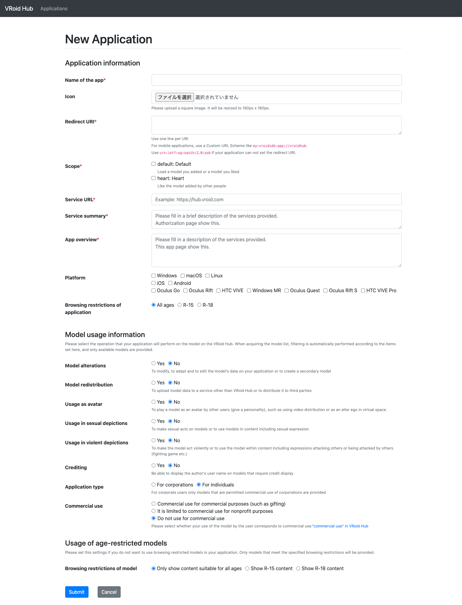

# VRoid SDK Developers

 [](https://github.com/pixiv/vroid-sdk-developers/discussions)
[](./README.ja.md)

If you are a developer and you're interented in using VRoid SDK in order to have your app featured on VRoid Hub, please apply using the application form below.  
[VRoid SDK application publication request.](https://www.pixiv.net/support.php?type=47&mode=inquiry&service=vroid-integrate)

Please note that we cannot provide support for inquiries that are not directly related to VRoid SDK (e.g inquiries about the development of apps on Unity or Inquiries about VRoid products).
## What can you do with VRoid SDK?
### Authentification of VRoid Hub using OAuth
In order to access models and users information on VRoid Hub, VRoid SDK has to go through Hub's API. VRoid Hub is an OAuth provider and you can obtain access tokens for the API by following the prescribed procedures.

The following information is set in this access token:

- API scopes limit
- Token expiration date

When a token expires, the VRoid SDK automatically reissues the token. API requires OAuth integration, which can be a complex procedure, so the SDK provides an interface where it can be easily executed.

### VRoid Hub's API Calls
You can run API calls to VRoid Hub by using C# via SDK. The call result is serialized as an object to be used in C#. The scope of the issued token determines the availability of the API. Therefore, depending on the application, a thorough check is required.

- `default`
    - Obtaining user information
    - Obtaining and downloading model information
    - Obtaining/uploading photos
- `heart`
    - Hearting a model
    - Unhearting a model

### Converting VRoid Hub models so that they can be used on Unity
- By using the CharacterModel ID from VRoid Hub, you can download models and convert them to GameObject that you can use on Unity. Data is locally stored as a cache, all in one method.
- Once a model is downloaded, it is encrypted and stored as a cache. As long as it is stored within the cache, there is no need for future downloads.

## How to Use
- Import "unitypackage" in the VRoid SDK onto Unity.
- Create a new application via the integrated application management page
- Download the credential.json.bytes from the created application management page and import into the project
- Scripting


### How to create integrated apps

#### Name of the app
- The name of the app you are creating

#### Redirect URI
- The URI used when receiving an Authorization code
    - For iOS and Android, you should use the URI scheme for the app
    - For Windows/MacOS, use `urn:ietf:wg:oauth:2.0:oob` or `http://127.0.0.1`
        - Use `urn:ietf:wg:oauth:2.0:oob` if manually inputting authorization code when linking the application
        - Use `http://127.0.0.1` if automatically inputting the authorization code when linking the application
- If you plan your app to be multi-platform, add new lines.

#### Scope
- Scopes determining which APIs are accessible.
    - default
        - Limited to basic API features such as obtaining user information or downloading models.
    - heart
        - API for hearting and unhearting models.
#### Services
- This URL is the URL displayed on the integrated apps confirmation page, The summary is also the summary that is displayed on the same integrated apps confirmation page.
#### Model usage information
- Model alterations
    - If set to "Yes", it will prevent your app from acquiring models that do not allow alterations.
- Model redistribution
    - If set to "Yes", it will prevent your app from acquiring models that do not allow redistribution.
- Usage as avatar
    - If set to "Yes", it will prevent your app from acquiring models that do not allow usage as avatar.
- Usage in sexual depictions
  - If set to "Yes", it will prevent your app from acquiring models that do not allow sexual depictions.
- Usage in violent depictions
  - If set to "Yes", it will prevent your app from acquiring models that do not allow violent depictions.
- Crediting
  - If set to "No", it will prevent your app from acquiring models that require credit attribution.
- Application type
    - Individual or corporate use
  - If for corporate use, only models used allowing commercial use by corporations can be acquired.
- Commercial use
  - If the app is for individual use, you can set how far you want to allow commercial use.
  - If the commercial use of a model is outside the scope of the settings mentioned, it cannot be acquired.

#### Usage of age-restricted models
- Select this option if you do not want to use age-restricted models on your app.

### Download the credential.json.bytes from the created application management page and import into the project
- From the application management page, click the "Create Credential file" button to create an SDK settings file


### Scripting
#### Initializing the VRoid SDK

```csharp
// Load downloaded credential.json.bytes
var credential = Resources.Load<TextAsset>("credential.json");
// app data to use for settings
var credentialJson = credential.text;
// Create Config to use for authorization
var config = OauthProvider.LoadConfigFromCredential(credentialJson);
```

#### OAuth Authentication

```csharp
// ThreadContext used for transmission
var context = SynchronizationContext.Current;
// Create Client to handle OAuth authentication
var oauthClient = OauthProvider.CreateOauthClient(config, context);
// Create Browser to use for login
var browser = BrowserProvider.Create(oauthClient, config);
// Local account file has been saved and is not expired
var isLoggedIn = oauthClient.IsAccountFileExist() && !oauthClient.IsAccessTokenExpired();
// Login
if (!isLoggedIn)
{
    //  If already authorized but expired, it gets reauthorized. 
    // Otherwise, opens browser and begins authorization flow.
    oauthClient.Login(
      browser,
      (account) => { /*When login succeeds*/ },
      (error) => { /*When login fails*/ }
    );
}
```

For iOS/Android, it is possible to retrieve authorization code via URL scheme. Because URL scheme calling cannot be carried out on desktop applications, it is possible to retrieve authorization code with [Loopback interface redirect](https://datatracker.ietf.org/doc/html/rfc8252#section-8.3) or manual registration. For manual input, call the authorization code displayed on the browser `browser#OnRegisterCode`, and issue token

```csharp
/*
* Omission
*/

browser.OnRegisterCode(authorizeCode);
```

#### API Calls
- It is possible to use VRoid Hub's API by using the API class that used Pixiv.VroidSdk.Oauth.Client through authorization
- Usable API's are [DefaultApi](https://developer.vroid.com/en/sdk/docs/0.1.0/Pixiv.VroidSdk.Api.DefaultApi.html), [HeartApi](https://developer.vroid.com/en/sdk/docs/0.1.0/Pixiv.VroidSdk.Api.HeartApi.html)

Example: Acquiring the list of models belonging to the logged-in user

```csharp
var oauthClient = OauthProvider.CreateOauthClient(config, context);

// Creates a DefaultApi with the authorizing Client
var defaultApi = new DefaultApi(oauthClient);
// The HeartScope API uses HeartApi
// var heartApi = new HeartApi(oauthClient);

// Login
if (!isLoggedIn)
{
    // If already authorized but expired, it gets reauthorized. 
    // Otherwise, opens browser and begins authorization flow.
    oauthClient.Login(
      browser,
      (_) => {
        // Can use API functions if authorization has completed
        defaultApi.GetAccountCharacterModels(10, (characterModels) => _characterModels = characterModels, (error) => { /*When retrieval failed*/ });
      },
      (error) => { /*When login failed*/ }
    );
}
```

#### Load models from VRoid Hub
- The data acquirable from VRoid Hub is a VRM file, so to be able to use it on Unity, it is necessary to convert it into a GameObject.
- Internally, we use the UniVRM to complete conversions, which is then used to pass the call back from the application.
- Downloaded files are encrypted and stored in cache.
    - The cache requires a password registration by the developer

```csharp
oauthClient.Login(
  browser,
  (account) => {
    // Initialize the ModelLoader used for model loading
    ModelLoader.Initialize(
      config,                  // Config made from Credentials
      defaultApi,              // Authorized API
      "PASSWORD_FOR_YOUR_APP", // The model's encryption password
      10                       // Maximum number of caches for a model
    );

    defaultApi.GetAccountCharacterModels(10, (models) => {
      // Start model loading
      ModelLoader.LoadVrm(
        models[0],  // Model to load
        (gameObject) => {
          // Callback after loading is complete
          gameObject.transform.parent = this.transform;
        },
        (progress) => {
          // Loading progress callback
        },
        (error) => {
          // Callback when an error occurs
        }
      );
    }, (error) => { });
  },
  (error) => { /*if login fails*/ }
);
```
## Links
- [VRoid SDK Guideline Summaries](https://app.box.com/s/tjhql9nm1zb3st24210d9udyg0d9h3vn)
- [Official Documents](https://developer.vroid.com/sdk/docs/VRoidSDK.html)
- [VRoid SDK Guidelines](https://vroid.pixiv.help/hc/en-us/articles/900000213643-VRoid-SDK-Guidelines)
- [Spectrum (previous support forum)](https://spectrum.chat/vroid-developers)
